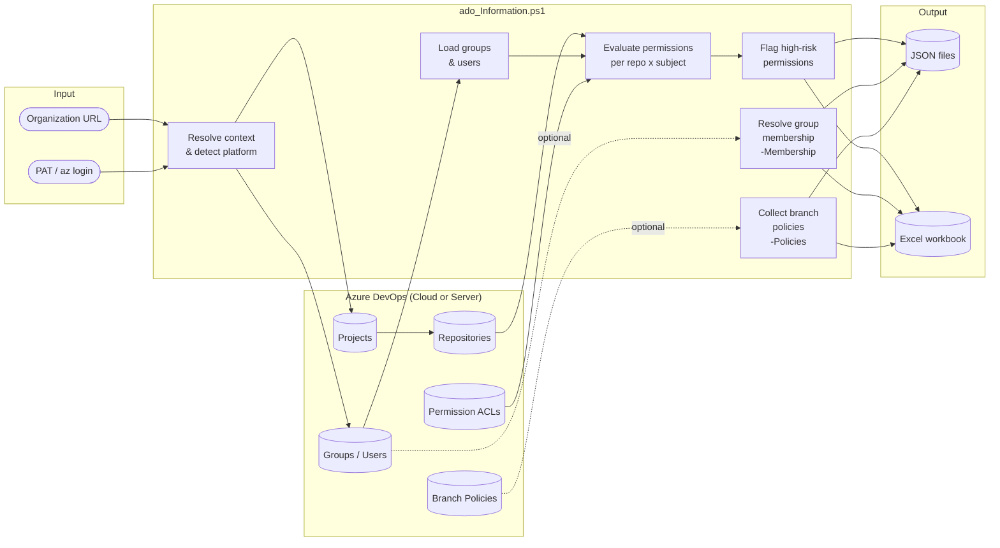
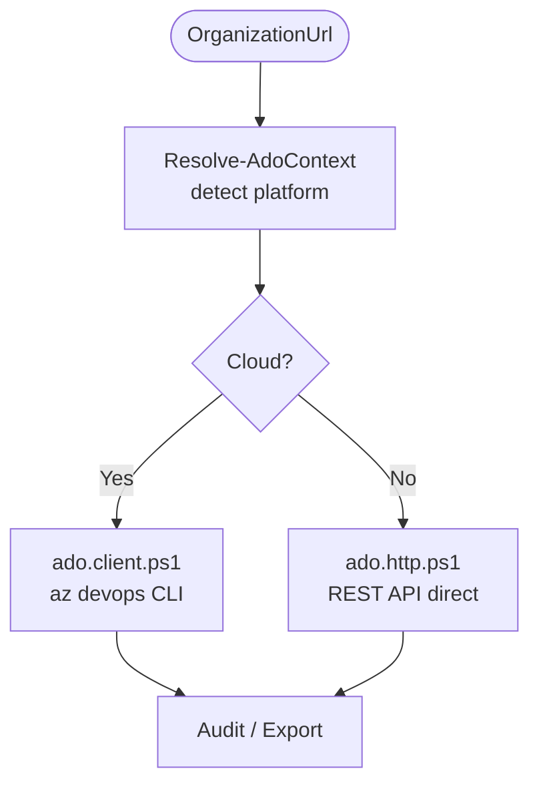
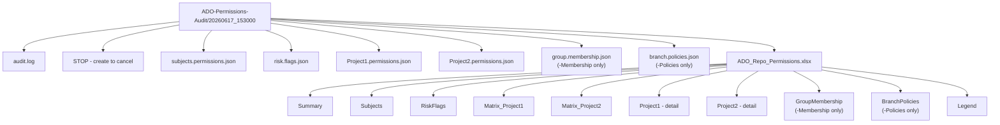
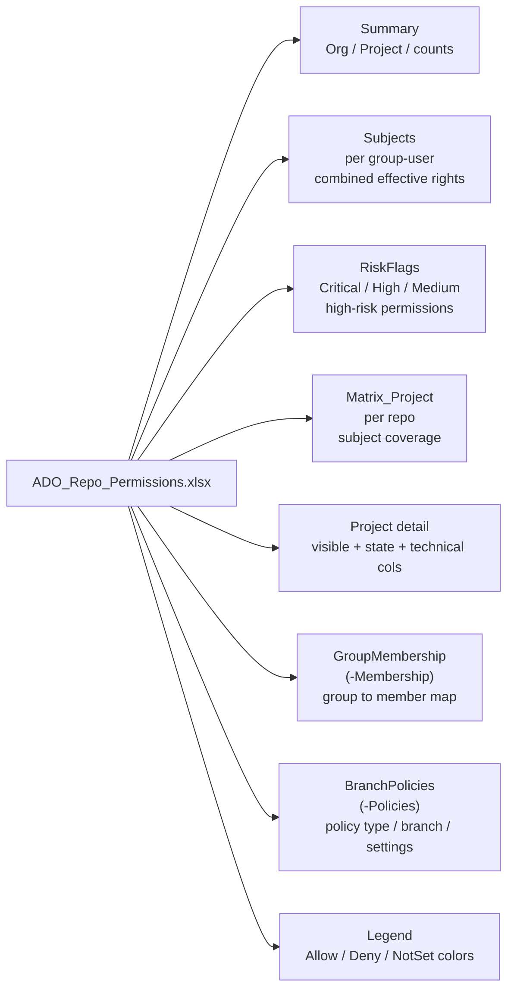

# Azure DevOps Repository Permissions Audit

This project provides a PowerShell script that audits Azure DevOps group and user permissions on Git repositories.
It supports **Azure DevOps Services** (cloud) and **Azure DevOps Server/TFS** (on-premises).

Script file:
- ado_Information.ps1

The script can:
- Enumerate organization groups and optional users.
- Read Git repository ACL entries per project and repository.
- Capture explicit, effective, and inherited permissions.
- Resolve group membership (members of every group) with `-Membership`.
- Enumerate branch policies per project with `-Policies`.
- Flag high-risk permission assignments (always included in output).
- Export one JSON file per project, plus subjects, risk flags, membership, and policies JSON.
- Export one Excel workbook with Summary, Subjects, RiskFlags, optional GroupMembership and BranchPolicies, per-project detail, and Legend sheets.



## Platform Support

The platform type is detected automatically from the `OrganizationUrl` parameter:

| URL format | Platform |
|---|---|
| `https://dev.azure.com/{org}` | Azure DevOps Services (cloud, modern) |
| `https://{org}.visualstudio.com` | Azure DevOps Services (cloud, legacy) |
| `https://{server}/{collection}` | Azure DevOps Server (on-premises) |
| `https://{server}/tfs/{collection}` | Azure DevOps Server (on-premises) |

The detected platform is logged at startup and determines the Graph API version used internally (`7.1-preview.1` for cloud, `5.1-preview.1` for server).

## Prerequisites

Install and configure the following:

1. **Windows PowerShell 5.1** or **PowerShell 7+** (parallel mode requires PowerShell 7+)
2. Azure CLI (**Azure DevOps Services / cloud only** — not required for Azure DevOps Server on-premises)
3. Azure DevOps Azure CLI extension (**cloud only**)
4. Access to the target Azure DevOps organization
5. Optional: ImportExcel PowerShell module (auto-installed by script when XLSX output is requested)

> **PowerShell compatibility note**
> All scripts are compatible with Windows PowerShell 5.1 and PowerShell 7+.
> The `-EnableParallel` flag is silently ignored on Windows PowerShell 5.1 — the script falls back to sequential mode automatically and logs a warning.

> **Azure DevOps Server (on-premises) note**
> The `az devops` CLI extension does not support Azure DevOps Server.
> When the script detects an on-premises URL, it automatically switches to direct REST API calls
> (see `src/ado.http.ps1`). Azure CLI is **not** required in this mode.
> Supported on-prem authentication modes are PAT, Basic username/password, and Windows integrated credentials.
> Azure CLI is auto-installed only when targeting Azure DevOps Services.

Minimum Azure DevOps access:
- Project and repository read access
- Security permission read access
- Graph/group read access

Authentication options:
- Interactive login with `az login` (Azure DevOps Services only)
- Personal Access Token (PAT) passed to the script as a SecureString (`-PatSecureString`)
- Basic username/password for on-prem (`-BasicUsername` + `-BasicPasswordSecureString`)
- Windows integrated credentials fallback on on-prem when no PAT/Basic is provided

## Authentication by Platform and Version

Use this matrix to pick the best authentication mode for your environment.

| Platform / version | Recommended auth | Also supported | Notes |
|---|---|---|---|
| Azure DevOps Services (cloud) | PAT (`-PatSecureString`) | `az login` | Uses Azure DevOps CLI transport (`src/ado.client.ps1`). |
| Azure DevOps Server 2019+ | PAT (`-PatSecureString`) | Basic, Windows integrated | Uses REST transport (`src/ado.http.ps1`). |
| Azure DevOps Server 2015/2017 | Basic or Windows integrated | PAT (depends on server config) | Graph/Identities endpoints may be partial depending on patch level. |
| TFS / very old on-prem (for example 2010 era) | Basic or Windows integrated | PAT usually unavailable/limited | Graph endpoints are commonly unavailable; script uses direct ACL mode where possible. |

## Compatibility Notes (Cloud and On-Prem)

Current behavior by platform generation:

| Environment | Current support level | Practical notes |
|---|---|---|
| Azure DevOps Services (latest cloud) | Full | Uses CLI transport in cloud mode. PAT and az login are supported. |
| Azure DevOps Server 2019/2020/2022 | Full | Uses REST transport in server mode. PAT, Basic, and Windows integrated are supported. |
| Older Azure DevOps Server / legacy TFS | Best effort | Graph/Identities endpoints may be unavailable. Script falls back to direct ACL collection when possible. |

Important:
- On some legacy servers, identity/group enrichment can be limited because Graph endpoints are not exposed.
- Permission collection can still proceed through direct ACL mode in many of those cases.

## Authentication Examples (English)

### 1) Cloud with PAT (recommended)

```powershell
$pat = Read-Host "Enter PAT" -AsSecureString
./ado_Information.ps1 -OrganizationUrl "https://dev.azure.com/your-org" -PatSecureString $pat -OutputFormat both
```

### 2) Cloud with az login (no PAT parameter)

```powershell
az login
./ado_Information.ps1 -OrganizationUrl "https://dev.azure.com/your-org" -OutputFormat json
```

### 3) On-prem (Server/TFS) with PAT

```powershell
$pat = Read-Host "Enter PAT" -AsSecureString
./ado_Information.ps1 -OrganizationUrl "http://myserver/Collection" -PatSecureString $pat -OutputFormat both
```

### 4) On-prem with Basic authentication

```powershell
$user = "DOMAIN\\username"
$pwd  = Read-Host "Enter Basic password" -AsSecureString
./ado_Information.ps1 -OrganizationUrl "http://myserver/Collection" -BasicUsername $user -BasicPasswordSecureString $pwd
```

### 5) On-prem with Windows integrated credentials

```powershell
# Run PowerShell as a user that already has access to the server/collection.
./ado_Information.ps1 -OrganizationUrl "http://myserver/Collection" -OutputFormat json
```

### 6) Legacy on-prem (older TFS) with Basic auth and minimal options

```powershell
$user = "username"
$pwd  = Read-Host "Enter password" -AsSecureString
./ado_Information.ps1 -OrganizationUrl "http://legacy-tfs/Collection" -BasicUsername $user -BasicPasswordSecureString $pwd -OutputFormat json
```

Notes:
- Do not pass PAT and Basic parameters together in the same command.
- For Basic auth, always provide both `-BasicUsername` and `-BasicPasswordSecureString`.
- If on-prem endpoints for groups/users are unavailable, the script can continue with direct ACL-based auditing.

## Files

- ado_Information.ps1: Orchestrator script (parameters, constants, execution flow)
- ado_Migration.ps1: Migration comparison script (snapshot source + destination, diff report)
- src/ado.logging.ps1: Logging, step timing, cancellation checks
- src/ado.context.ps1: URL resolution, platform detection, PAT conversion, output initialization
- src/ado.client.ps1: Azure DevOps CLI calls, validation, project/subject/repo loading (**cloud only**)
- src/ado.http.ps1: Direct REST API calls for Azure DevOps Server on-premises (**server only**, loaded automatically)
- src/ado.permissions.ps1: Permission decoding, state mapping, audit-row building
- src/ado.export.ps1: JSON/XLSX exports — all sheets and JSON files
- src/ado.audit.ps1: Permission collection loop (sequential/parallel)
- src/ado.membership.ps1: Group membership resolution (`-IncludeGroupMembership`)
- src/ado.policies.ps1: Branch policy collection and high-risk permission flagging (`-IncludeBranchPolicies`)
- src/ado.snapshot.ps1: Snapshot build / save / load (used by ado_Migration.ps1)
- src/ado.compare.ps1: Snapshot comparison and diff export (used by ado_Migration.ps1)
- README.md: Usage documentation
- doc/MIGRATION.md: Migration comparison documentation
- doc/implementation.md: Internal implementation details
- doc/SECURITY_AUDIT.md: Security audit results

## Platform Architecture

The platform type is detected automatically from the `OrganizationUrl` parameter.
Based on the result, a different set of API functions is loaded:



| URL format | Platform | API transport |
|---|---|---|
| `https://dev.azure.com/{org}` | Cloud | `az devops` CLI |
| `https://{org}.visualstudio.com` | Cloud | `az devops` CLI |
| `https://{server}/{collection}` | Server | REST HTTP (PAT / Basic / Windows integrated) |
| `https://{server}/tfs/{collection}` | Server | REST HTTP (PAT / Basic / Windows integrated) |

`ado.http.ps1` overrides the following functions at script scope when Server is detected:
`Invoke-AdoValidation`, `Get-Projects`, `Get-Subjects`, `Get-Repositories`,
`Get-PermissionEntry`, `Get-GroupMemberships`, `Get-BranchPolicies`.

## Naming Convention Recommendation

Use a stable `ado_` prefix for the entry script and lower-case domain files for helpers:

- `ado_Information.ps1`
- `ado.logging.ps1`
- `ado.context.ps1`
- `ado.client.ps1`
- `ado.permissions.ps1`
- `ado.export.ps1`
- `ado.audit.ps1`


This keeps the main script easy to discover while preserving domain-focused helper names.

Benefits:

- clear ownership by domain
- predictable file discovery
- easier onboarding and targeted refactoring

## Script Parameters

- OrganizationUrl (required): Azure DevOps organization or collection URL
  - Cloud (modern)  : `https://dev.azure.com/your-org`
  - Cloud (legacy)  : `https://your-org.visualstudio.com`
  - Server on-prem  : `https://myserver/tfs/DefaultCollection`
  - Server on-prem  : `https://myserver/MyCollection`
- PatSecureString (optional): Personal Access Token for Azure DevOps as `SecureString`
  - Recommended when running from an interactive PowerShell session
- ProjectName (optional): If provided, limits execution to one project
- OutputFormat (optional): json, xlsx, or both (default: both)
- DesktopFolderName (optional): Output root folder name created on Windows Desktop (default: ADO-Permissions-Audit)
- EnableRetry (optional): Enables retry with exponential backoff for transient Azure CLI/API failures
- RetryMaxAttempts (optional): Max attempts when retry is enabled (default: 3)
- RetryBaseDelayMs (optional): Base delay in milliseconds for exponential backoff (default: 500)
- IncludeUsers (alias: `-Users`): Includes user subjects in addition to groups
- IncludeGroupMembership (alias: `-Membership`): Resolves members of every group; adds GroupMembership sheet and `group.membership.json`
- IncludeBranchPolicies (alias: `-Policies`): Collects branch policies per project; adds BranchPolicies sheet and `branch.policies.json`
- EnableParallel (optional): Enables parallel repository processing (**PowerShell 7+ only** — automatically ignored on Windows PowerShell 5.1)
- ParallelThrottleLimit (optional): Max parallel workers when parallel mode is enabled (default: 4)

## Basic Usage

Minimal run — repo permissions only (cloud):

```powershell
$securePat = Read-Host "Enter Azure DevOps PAT" -AsSecureString
./ado_Information.ps1 -OrganizationUrl "https://dev.azure.com/your-org" -PatSecureString $securePat -OutputFormat both
```

Full audit — membership + branch policies + users (cloud):

```powershell
$securePat = Read-Host "Enter Azure DevOps PAT" -AsSecureString
./ado_Information.ps1 -OrganizationUrl "https://dev.azure.com/your-org" -PatSecureString $securePat `
    -Users -Membership -Policies -OutputFormat both
```

Run for all projects — Azure DevOps Services, legacy URL:

```powershell
$securePat = Read-Host "Enter Azure DevOps PAT" -AsSecureString
./ado_Information.ps1 -OrganizationUrl "https://your-org.visualstudio.com" -PatSecureString $securePat -OutputFormat both
```

Run for all projects — Azure DevOps Server (on-premises):

```powershell
$securePat = Read-Host "Enter Azure DevOps PAT" -AsSecureString
./ado_Information.ps1 -OrganizationUrl "https://myserver/tfs/DefaultCollection" -PatSecureString $securePat -OutputFormat both
```

Run for one project only:

```powershell
$securePat = Read-Host "Enter Azure DevOps PAT" -AsSecureString
./ado_Information.ps1 -OrganizationUrl "https://dev.azure.com/your-org" -PatSecureString $securePat -ProjectName "MyProject" -OutputFormat both
```

Run with interactive Azure CLI authentication (no PAT argument):

```powershell
az login
./ado_Information.ps1 -OrganizationUrl "https://dev.azure.com/your-org" -OutputFormat json
```

Run with retry and parallel processing:

```powershell
$securePat = Read-Host "Enter Azure DevOps PAT" -AsSecureString
./ado_Information.ps1 -OrganizationUrl "https://dev.azure.com/your-org" -PatSecureString $securePat `
    -OutputFormat both -EnableRetry -RetryMaxAttempts 3 -RetryBaseDelayMs 500 -EnableParallel -ParallelThrottleLimit 4
```

## Command-Line Examples

Run with custom desktop output folder name:

```powershell
$securePat = Read-Host "Enter Azure DevOps PAT" -AsSecureString
./ado_Information.ps1 -OrganizationUrl "https://dev.azure.com/your-org" -PatSecureString $securePat -DesktopFolderName "ADO-Audit-Weekly"
```

Run only JSON export (faster):

```powershell
$securePat = Read-Host "Enter Azure DevOps PAT" -AsSecureString
./ado_Information.ps1 -OrganizationUrl "https://dev.azure.com/your-org" -PatSecureString $securePat -OutputFormat json
```

Run only XLSX export:

```powershell
$securePat = Read-Host "Enter Azure DevOps PAT" -AsSecureString
./ado_Information.ps1 -OrganizationUrl "https://dev.azure.com/your-org" -PatSecureString $securePat -OutputFormat xlsx
```

Run for one specific project:

```powershell
$securePat = Read-Host "Enter Azure DevOps PAT" -AsSecureString
./ado_Information.ps1 -OrganizationUrl "https://dev.azure.com/your-org" -PatSecureString $securePat -ProjectName "Platform-Core" -OutputFormat both
```

## Output Structure

The script creates this folder:

- `Desktop/<DesktopFolderName>/<timestamp>`

Example: `Desktop/ADO-Permissions-Audit/20260617_153000`



**JSON files**
- `subjects.permissions.json` — all groups/users with aggregated effective permissions across all repos
- `risk.flags.json` — all subjects that hold at least one high-risk permission bit
- `<ProjectName>.permissions.json` — full per-repository permission rows for each project
- `group.membership.json` — group membership rows _(only when `-Membership` is used)_
- `branch.policies.json` — branch policy rows _(only when `-Policies` is used)_

**Excel workbook** (`ADO_Repo_Permissions.xlsx`)
- **Summary** — one row per project with totals (repos, subjects, allow/deny counts)
- **Subjects** — one row per group/user with combined effective permissions across all repos
- **RiskFlags** — subjects with high-risk bits: `Administer`, `ManagePermissions`, `BypassPoliciesWhenCompletingPR`, `PolicyExempt`, `ForcePush`, `DeleteOrDisableRepository`
- **Matrix_\<Project\>** — one row per repository with subject assignment coverage
- **\<Project\>** — full detail rows (one per repo × subject)
- **GroupMembership** — members of every group _(only when `-Membership` is used)_
- **BranchPolicies** — branch policies per project/repo _(only when `-Policies` is used)_
- **Legend** — color-coding reference for permission states

## Exported Data Fields

### Per-project permission rows (`<ProjectName>.permissions.json` / detail sheets)

| Field | Description |
|---|---|
| `Organization` | Organization URL |
| `ProjectName` / `ProjectId` | Project identity |
| `RepositoryName` / `RepositoryId` | Repository identity |
| `SubjectType` | `Group` or `User` |
| `SubjectDisplayName` / `SubjectPrincipalName` | Subject identity |
| `SubjectDescriptor` / `SubjectOrigin` | Technical subject identifiers |
| `InheritanceEnabled` | Whether ACL inheritance is active |
| `AllowBits` / `DenyBits` | Explicit permission bitmasks |
| `AllowPermissions` / `DenyPermissions` | Decoded explicit permission names |
| `EffectiveAllowBits` / `EffectiveDenyBits` | Final effective bitmasks |
| `EffectiveAllowDisplay` / `EffectiveDenyDisplay` | Human-readable effective permissions |
| `InheritedAllowBits` / `InheritedDenyBits` | Inherited bitmasks |
| `InheritedAllowDisplay` / `InheritedDenyDisplay` | Human-readable inherited permissions |
| `State_<PermissionName>` | Per-bit state: `Allow`, `Deny`, `NotSet`, `NotSetInherited` |

### Subjects summary (`subjects.permissions.json` / Subjects sheet)

| Field | Description |
|---|---|
| `SubjectType` | `Group` or `User` |
| `SubjectDisplayName` / `SubjectPrincipalName` | Subject identity |
| `SubjectOrigin` | Identity origin (AAD, ADFS, etc.) |
| `ProjectCount` | Number of distinct projects the subject appears in |
| `RepositoryCount` | Number of distinct repos where permissions are set |
| `AllowAssignments` | Count of repos with explicit Allow bits |
| `DenyAssignments` | Count of repos with explicit Deny bits |
| `CombinedEffectiveAllowDisplay` | Union of all effective Allow permissions across all repos |
| `CombinedEffectiveDenyDisplay` | Union of all effective Deny permissions across all repos |

## Workbook Columns



Column categories in detail sheets:
- **Visible columns** — project, repository, subject, origin, inheritance, readable permission summaries
- **State columns** — one column per permission bit: `Allow`, `Deny`, `NotSet`, or `NotSetInherited` (color-coded, hidden by default)
- **Technical columns** — raw bitmasks and descriptors (hidden by default)

**RiskFlags sheet** classifies subjects by severity:

| RiskLevel | Permissions triggering it |
|---|---|
| Critical | `Administer`, `ManagePermissions` |
| High | `BypassPoliciesWhenCompletingPR`, `PolicyExempt` |
| Medium | `ForcePush`, `DeleteOrDisableRepository` |

**Subjects sheet** (`CombinedEffective*`) shows the union of all effective permission bits across every repository — useful for quickly identifying overprivileged identities.

## Notes on Inheritance

Inheritance is represented in multiple ways:

- InheritanceEnabled: Indicates whether ACL inheritance is enabled at the token level.
- Inherited* fields: Show inherited permission values when returned by Azure DevOps.
- Effective* fields: Show final effective values after inheritance is applied.

## Expected Runtime and API Limits

Execution time depends mainly on:

- Number of projects
- Number of repositories per project
- Number of ACL entries per repository token
- Azure DevOps API response time and throttling behavior

Typical guidance:

- Small organization (1-5 projects, <50 repos): usually a few minutes
- Medium organization (5-20 projects, 50-300 repos): often 5-20 minutes
- Large organization (20+ projects, 300+ repos): can take 20+ minutes

Current script behavior:

- Calls Azure DevOps APIs sequentially for reliability and simpler troubleshooting
- Produces complete data per project before moving to the next one
- May slow down when APIs return throttling responses or when network latency is high

Recommendations for large organizations:

1. Start with one project using ProjectName to estimate runtime.
2. Use OutputFormat json for faster runs when Excel output is not required.
3. Run during off-peak hours to reduce throttling risk.
4. If needed, split runs by project groups and merge outputs later.

Potential throttling indicators:

- Intermittent failures from az devops invoke
- Increased response latency over time
- Retry-like behavior required to complete all projects

If throttling becomes frequent, use `-EnableRetry` to activate built-in exponential backoff. Tune with `-RetryMaxAttempts` and `-RetryBaseDelayMs` as needed.

## Troubleshooting

1. Command failed: Cannot query Azure DevOps
- Verify login: az login
- Verify organization URL
- If using PAT, verify token validity and scopes

2. Azure DevOps extension not found
- Install manually: az extension add --name azure-devops

3. XLSX export fails
- Check Internet access for ImportExcel module installation
- Install manually:

```powershell
Install-Module ImportExcel -Scope CurrentUser -Force -AllowClobber
```

4. Empty output for a project
- Verify repository existence and permissions
- Verify group visibility in Graph API

## Runtime Monitoring (dotnet-counters)

You can monitor the PowerShell process used to run the script and track actual CPU usage vs available CPU count.

1. Get the process id (PID) of your running PowerShell process.
2. Start dotnet-counters with the following metrics:

```powershell
dotnet-counters monitor --counters System.Runtime[dotnet.process.cpu.usage,dotnet.process.cpu.count,dotnet.thread_pool.thread.count,dotnet.thread_pool.queue.length,dotnet.thread_pool.work_item.count] -p <PID>
```

How to read these metrics:

- `dotnet.process.cpu.usage`: real CPU usage consumed by the process (percentage).
- `dotnet.process.cpu.count`: number of logical CPUs available to the process (capacity indicator, not usage).
- `dotnet.thread_pool.thread.count`: current number of thread pool worker threads.
- `dotnet.thread_pool.queue.length`: current queued work items waiting to run.
- `dotnet.thread_pool.work_item.count`: cumulative number of work items processed since process start.

Important interpretation note:

- `queue.length = 0` with a high `work_item.count` means work has been processed and there is no backlog at the sampling moment.

## Security Recommendations

- Prefer secure secret handling for PAT values (for example, environment variables or secret vaults).
- Avoid hardcoding PAT values in scripts or source control.
- Rotate PATs regularly.

## Quick Start Checklist

1. Open PowerShell
2. Go to the project directory
3. Authenticate (`az login`) or prepare PAT
4. Run `ado_Information.ps1`
5. Open output files from Desktop folder

---

## Migration Comparison

Use `ado_Migration.ps1` to validate that a migration succeeded. It takes a snapshot of the source organization, a snapshot of the destination, and produces a diff report.

```powershell
$srcPat = Read-Host "Source PAT" -AsSecureString
$dstPat = Read-Host "Destination PAT" -AsSecureString

./ado_Migration.ps1 -Mode Full `
    -SrcOrg "https://myserver/tfs/DefaultCollection" -SrcPat $srcPat `
    -DstOrg "https://dev.azure.com/my-new-org"       -DstPat $dstPat `
    -Membership -Policies -Out both
```

Supported scenarios: cloud-to-cloud, on-prem-to-cloud, cloud-to-on-prem, on-prem-to-on-prem.

See [MIGRATION.md](doc/MIGRATION.md) for full documentation.
