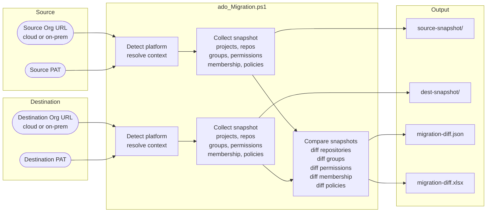
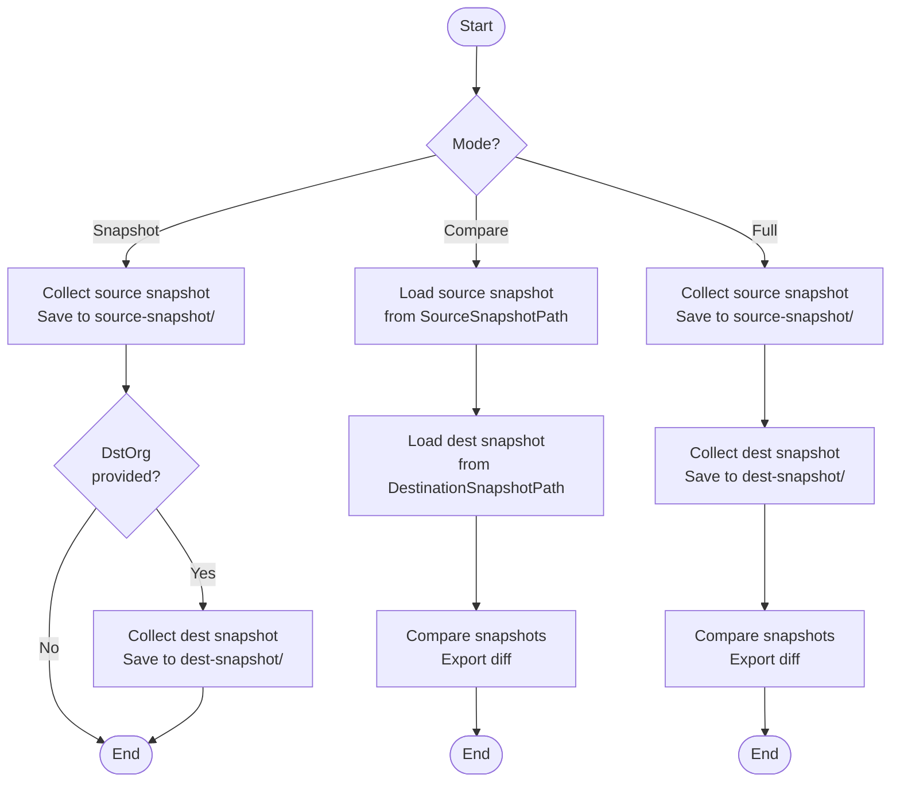
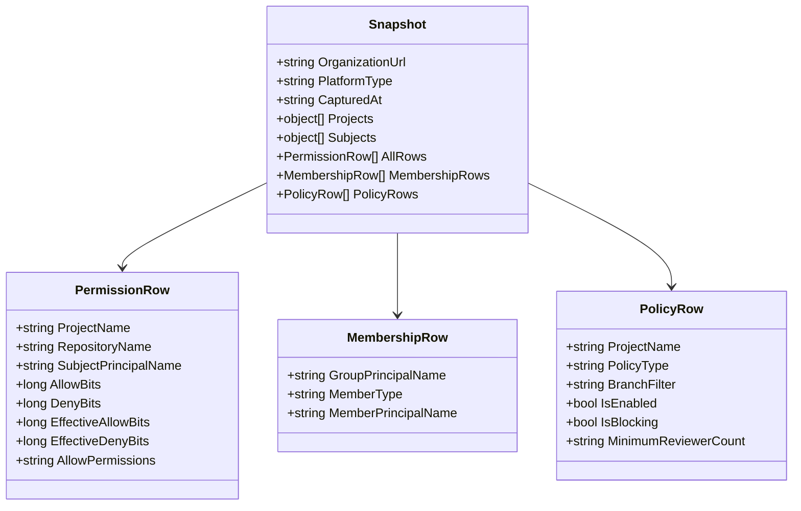
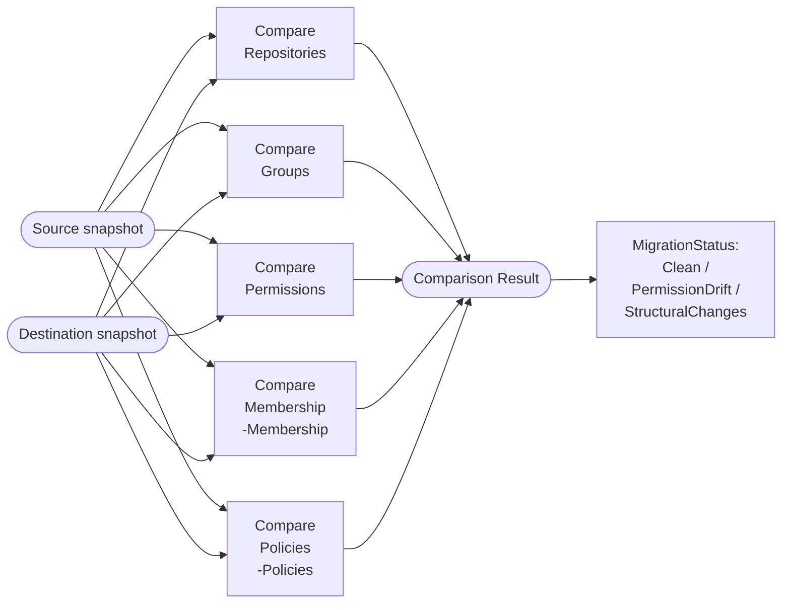
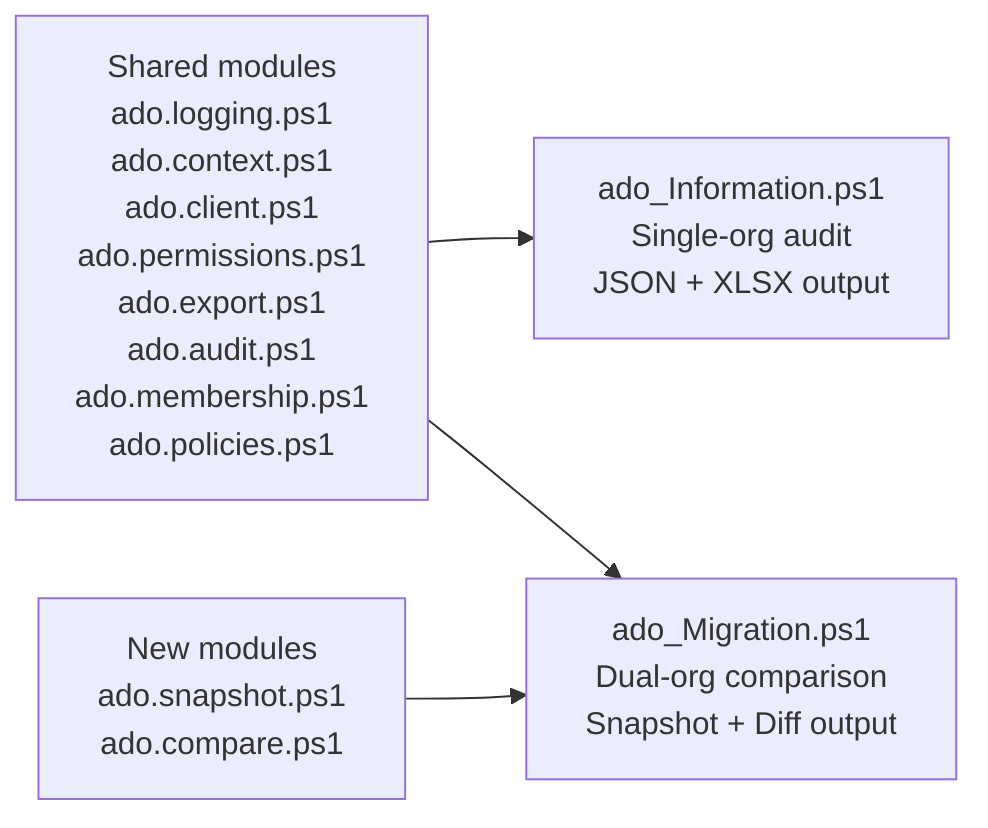

# Azure DevOps Migration Comparison

`ado_Migration.ps1` validates that an Azure DevOps migration succeeded by capturing permission snapshots from the source and destination organizations, then comparing them.

It supports every migration topology: **cloud-to-cloud**, **on-prem-to-cloud**, **cloud-to-on-prem**, and **on-prem-to-on-prem**.

---

## Architecture



---

## Execution Modes



---

## Platform Support

Each organization URL is detected independently:

| URL format | Detected platform | Graph API version |
|---|---|---|
| `https://dev.azure.com/{org}` | Cloud | `7.1-preview.1` |
| `https://{org}.visualstudio.com` | Cloud | `7.1-preview.1` |
| `https://{server}/{collection}` | Server | `5.1-preview.1` |
| `https://{server}/tfs/{collection}` | Server | `5.1-preview.1` |

This allows cross-platform comparisons (e.g., on-prem 2022 → Azure DevOps Services).

---

## Output Structure

```mermaid
flowchart TD
    Root[ADO-Migration-Audit/20260704_120000]
    Root --> Log[migration.log]
    Root --> Stop[STOP - create to cancel]
    Root --> SrcDir[source-snapshot/]
    Root --> DstDir[dest-snapshot/]
    Root --> DiffJSON[migration-diff.json]
    Root --> DiffXLSX[migration-diff.xlsx]

    SrcDir --> SM[snapshot.meta.json]
    SrcDir --> SP[snapshot.projects.json]
    SrcDir --> SS[snapshot.subjects.json]
    SrcDir --> SX[snapshot.permissions.json]
    SrcDir --> SMM[snapshot.membership.json\n-Membership only]
    SrcDir --> SPP[snapshot.policies.json\n-Policies only]

    DstDir --> DM[snapshot.meta.json]
    DstDir --> DP[snapshot.projects.json]
    DstDir --> DS[snapshot.subjects.json]
    DstDir --> DX[snapshot.permissions.json]

    DiffXLSX --> XS[Summary]
    DiffXLSX --> XR[RepoChanges]
    DiffXLSX --> XG[GroupChanges]
    DiffXLSX --> XP[PermissionChanges]
    DiffXLSX --> XMM[MembershipChanges\n-Membership only]
    DiffXLSX --> XPP[PolicyChanges\n-Policies only]
```



---

## Snapshot Data Model



---

## Comparison Logic



### Match keys used for comparison

| Data type | Match key |
|---|---|
| Repository | `ProjectName + RepositoryName` (case-insensitive) |
| Group / User | `SubjectPrincipalName` (case-insensitive) |
| Permission | `ProjectName + RepositoryName + SubjectPrincipalName` |
| Membership | `GroupPrincipalName + MemberPrincipalName` |
| Branch policy | `ProjectName + RepositoryId + BranchFilter + PolicyType` |

### DiffStatus values

| Status | Color in XLSX | Meaning |
|---|---|---|
| `Added` | Green | Present in destination, not in source |
| `Removed` | Red | Present in source, not in destination |
| `Changed` | Yellow | Present in both, but settings differ |
| `Matched` | (hidden) | Identical in source and destination |

### MigrationStatus values

| Status | Meaning |
|---|---|
| `Clean` | No removed repos, no removed groups, no removed or changed permissions |
| `PermissionDrift` | At least one permission was removed or changed |
| `StructuralChanges` | Repos or groups were removed, but permissions are not degraded |

---

## Parameters

| Parameter | Alias | Required | Description |
|---|---|---|---|
| `-Mode` | | No | `Snapshot`, `Compare`, or `Full` (default: `Full`) |
| `-SourceOrganizationUrl` | `-SrcOrg` | Snapshot/Full | Source ADO org or collection URL |
| `-SourcePat` | `-SrcPat` | No | Source PAT as SecureString |
| `-DestinationOrganizationUrl` | `-DstOrg` | Full | Destination ADO org or collection URL |
| `-DestinationPat` | `-DstPat` | No | Destination PAT as SecureString |
| `-ProjectName` | `-Project` | No | Scope both orgs to the same project name |
| `-SourceSnapshotPath` | | Compare | Path to existing source snapshot folder |
| `-DestinationSnapshotPath` | | Compare | Path to existing destination snapshot folder |
| `-IncludeGroupMembership` | `-Membership` | No | Resolve group members in snapshots |
| `-IncludeBranchPolicies` | `-Policies` | No | Collect branch policies in snapshots |
| `-OutputFormat` | `-Out` | No | `json`, `xlsx`, or `both` (default: `both`) |
| `-DesktopFolderName` | | No | Output root folder name (default: `ADO-Migration-Audit`) |
| `-EnableRetry` | | No | Retry transient API failures |

---

## Usage Examples

### Full migration comparison — on-prem to cloud

```powershell
$srcPat = Read-Host "Source PAT" -AsSecureString
$dstPat = Read-Host "Destination PAT" -AsSecureString

./ado_Migration.ps1 -Mode Full `
    -SourceOrganizationUrl      "https://myserver/tfs/DefaultCollection" `
    -SourcePat                   $srcPat `
    -DestinationOrganizationUrl "https://dev.azure.com/my-new-org" `
    -DestinationPat              $dstPat `
    -Membership -Policies -Out both
```

### Cloud-to-cloud comparison (single project)

```powershell
$srcPat = Read-Host "Source PAT" -AsSecureString
$dstPat = Read-Host "Destination PAT" -AsSecureString

./ado_Migration.ps1 -Mode Full `
    -SrcOrg "https://dev.azure.com/old-org" -SrcPat $srcPat `
    -DstOrg "https://dev.azure.com/new-org" -DstPat $dstPat `
    -Project "Platform-Core"
```

### Capture snapshot before migration (pre-flight)

```powershell
$srcPat = Read-Host "Source PAT" -AsSecureString
./ado_Migration.ps1 -Mode Snapshot `
    -SrcOrg "https://myserver/tfs/DefaultCollection" -SrcPat $srcPat `
    -Membership -Policies
```

### Compare saved snapshots after migration

```powershell
./ado_Migration.ps1 -Mode Compare `
    -SourceSnapshotPath      "C:\Users\you\Desktop\ADO-Migration-Audit\20260704_090000\source-snapshot" `
    -DestinationSnapshotPath "C:\Users\you\Desktop\ADO-Migration-Audit\20260705_090000\source-snapshot"
```

---

## Relationship to ado_Information.ps1



`ado_Migration.ps1` reuses all existing modules and adds two new ones:
- **[src/ado.snapshot.ps1](../src/ado.snapshot.ps1)** — builds, saves, and loads snapshot objects
- **[src/ado.compare.ps1](../src/ado.compare.ps1)** — compares two snapshots and exports diff reports
