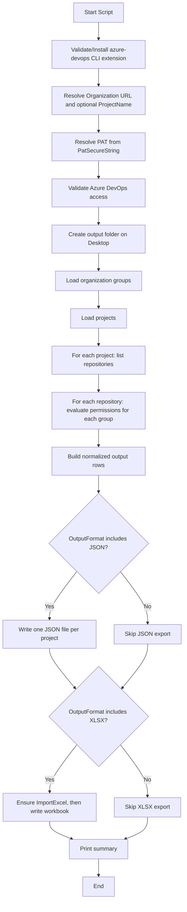
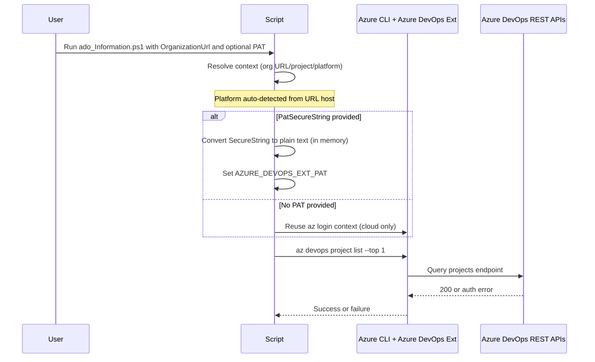
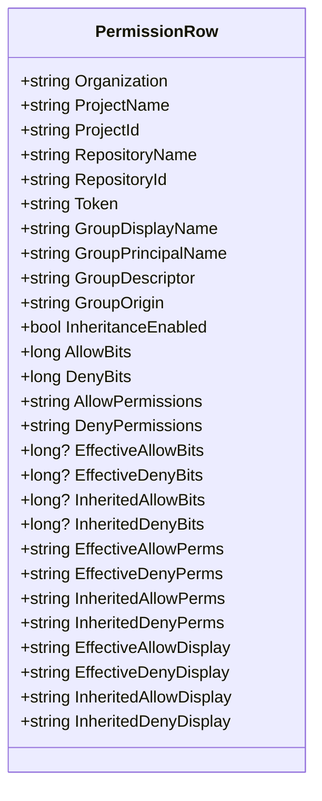

# Implementation Details: Azure DevOps Repository Permissions Audit

## Overview
This document explains the implementation of `ado_Information.ps1` in detail, including execution flow, data transformations, authentication strategy, and output generation.

The script audits Azure DevOps Git repository permissions for groups across one or more projects, then exports the results to JSON and/or Excel.

## High-Level Goals
- Discover relevant Azure DevOps groups.
- Enumerate projects and repositories.
- Read Git permission ACL data per repository and group.
- Compute explicit, inherited, and effective permission information.
- Export audit data in human-readable form.

## Runtime Entry Points
The script is driven by these parameters:
- `OrganizationUrl` (required): Azure DevOps organization URL.
- `PatSecureString` (optional): secure PAT input (recommended).
- `ProjectName` (optional): scope to a single project.
- `OutputFormat` (optional): `json`, `xlsx`, or `both`.
- `DesktopFolderName` (optional): output root folder name.

## End-to-End Flow


## Authentication and Context Resolution
### Platform detection and Organization URL normalization
`Resolve-AdoContext` normalizes `OrganizationUrl`, detects the target platform, and derives `ProjectName` when possible.

Platform detection rules:

| Host pattern | Platform | Notes |
|---|---|---|
| `dev.azure.com` | `Cloud` | Modern Azure DevOps Services URL |
| `*.visualstudio.com` | `Cloud` | Legacy Azure DevOps Services URL |
| Anything else | `Server` | Azure DevOps Server (on-premises) |

The detected platform is stored in `$Script:AdoPlatform` and returned as `PlatformType` in the context object.

URL normalization behavior:
- Trims whitespace and trailing slash.
- Parses URL with `System.Uri`.
- For `dev.azure.com`, extracts the first path segment as the organization name and rebuilds a canonical URL.
- For `*.visualstudio.com`, the URL is used as-is; `az devops` CLI accepts this format directly.
- For Azure DevOps Server, the full collection URL is passed as-is to the CLI (e.g., `https://myserver/tfs/DefaultCollection`).
- If no explicit `ProjectName` was given and a second path segment exists (cloud) or first segment (legacy), it is used as the project name.

Examples:

| Input URL | Resolved org URL | Derived project | Platform |
|---|---|---|---|
| `https://dev.azure.com/contoso/My%20Project` | `https://dev.azure.com/contoso` | `My Project` | Cloud |
| `https://contoso.visualstudio.com/MyProject` | `https://contoso.visualstudio.com` | `MyProject` | Cloud |
| `https://myserver/tfs/DefaultCollection` | `https://myserver/tfs/DefaultCollection` | _(none)_ | Server |

### Graph API version selection
The Graph API version is chosen automatically based on the detected platform and stored in `$Script:AdoGraphApiVersion`:
- `Cloud` → `7.1-preview.1`
- `Server` → `5.1-preview.1` (compatible with Azure DevOps Server 2019+)

### PAT handling
The script supports one PAT input:
- `-PatSecureString` (preferred)

Implementation details:
- `ConvertFrom-SecureStringToPlainText` uses `SecureStringToBSTR` and `ZeroFreeBSTR` to safely convert for CLI usage.
- The resolved PAT is assigned to `AZURE_DEVOPS_EXT_PAT` so Azure DevOps CLI commands can authenticate.

### Authentication flow


## Group Discovery Strategy
The script attempts group discovery in two stages:
1. Primary: `az devops security group list --scope organization`
2. Fallback: `az devops invoke --area Graph --resource Groups --api-version <detected-version>`

Why this strategy:
- Native command is more stable for most tenants.
- Fallback keeps compatibility when the primary command fails in specific environments (including some Azure DevOps Server configurations).
- The API version is dynamically chosen based on the detected platform (`7.1-preview.1` for cloud, `5.1-preview.1` for server).

Discovered groups are indexed by descriptor in a hashtable for fast lookups:
- `DisplayName`
- `PrincipalName`
- `Descriptor`
- `Origin`

## Project and Repository Enumeration
Project scope behavior:
- If `ProjectName` is set: load a single project via `az devops project show`.
- Otherwise: load all projects via `az devops project list`.

Repository enumeration:
- For each project: `az repos list --project <projectName>`.
- Each repository is mapped to a Git token format:
  - `repoV2/<projectId>/<repoId>`

## Permission Retrieval Model
The script evaluates permissions for each `(project, repository, group)` tuple via:
- `az devops security permission show --id <GitNamespaceId> --subject <descriptor> --token <repoToken>`

Key namespace:
- Git namespace ID: `2e9eb7ed-3c0a-47d4-87c1-0ffdd275fd87`

Returned ACL data includes:
- `allow`
- `deny`
- `extendedInfo.effectiveAllow`
- `extendedInfo.effectiveDeny`
- `extendedInfo.inheritedAllow`
- `extendedInfo.inheritedDeny`

The script keeps rows only when at least one meaningful permission value exists (explicit/effective/inherited not all zero/null).

## Permission Bit Decoding
### Decode function
`Decode-GitPermissionBits` maps bit flags to friendly permission names.

Examples:
- `2` -> `Read`
- `4` -> `Contribute`
- `16` -> `CreateBranch`
- `16384` -> `PullRequestContribute`
- `65536` -> `ViewAdvSecAlerts`

### Human-readable display fields
To improve readability, the script adds computed display fields:
- `EffectiveAllowDisplay`
- `EffectiveDenyDisplay`
- `InheritedAllowDisplay`
- `InheritedDenyDisplay`

Formatting convention:
- `<bits> (<decoded-names>)`
- Example: `229238 (Contribute;CreateBranch;ViewAdvSecAlerts)`

## Data Model


## Output Generation
### JSON export
- One file per project:
  - `<ProjectName>.permissions.json`
- Each file contains an array of normalized permission rows.

### Excel export
- Single workbook: `ADO_Repo_Group_Permissions.xlsx`
- One worksheet per project.
- Worksheet names are sanitized and truncated to Excel constraints.
- If a project has no rows, a placeholder row is written so the worksheet still exists.

## Error Handling
### Command execution wrapper
`Invoke-AdoCliJson` centralizes command execution:
- Executes command with stderr capture.
- Throws detailed errors when exit code is non-zero.
- Parses JSON output into objects.
- Supports optional retry with exponential backoff for transient failures.

Benefits:
- Consistent error behavior.
- Better diagnostics from Azure CLI output.
- Less repeated boilerplate.
- Better resiliency during throttling and temporary network/service failures.

### Common failure classes
- Authentication failure (`az login` missing, invalid/expired PAT).
- Azure DevOps extension missing or not installed.
- API throttling/timeouts in larger organizations.
- Permission denied for project/security scope.

## Performance Characteristics
The current implementation is intentionally sequential:
- Projects are processed one by one.
- Repositories are processed one by one by default.
- Groups are evaluated one by one.

Optional acceleration:
- `-EnableParallel` parallelizes repository processing per project.
- `-ParallelThrottleLimit` controls maximum concurrent workers.
- If PowerShell version is lower than 7, the script automatically falls back to sequential mode.

Tradeoffs:
- Pros: simpler logic, deterministic behavior, easier troubleshooting.
- Cons: slower on large orgs with many groups/repos.

Complexity is roughly proportional to:
- `#projects * #repositories per project * #groups`


## Security Notes
- Prefer `-PatSecureString` in interactive sessions.
- Avoid hardcoding PATs in scripts, command history, or source control.
- Rotate PATs regularly.
- Limit PAT scopes to minimum required permissions.

## Suggested Command Patterns
### Recommended (secure input) — Azure DevOps Services
```powershell
$securePat = Read-Host "Enter Azure DevOps PAT" -AsSecureString
./ado_Information.ps1 -OrganizationUrl "https://dev.azure.com/your-org" -PatSecureString $securePat -OutputFormat both
```

### Azure DevOps Services — legacy URL
```powershell
$securePat = Read-Host "Enter Azure DevOps PAT" -AsSecureString
./ado_Information.ps1 -OrganizationUrl "https://your-org.visualstudio.com" -PatSecureString $securePat -OutputFormat both
```

### Azure DevOps Server (on-premises)
```powershell
$securePat = Read-Host "Enter Azure DevOps PAT" -AsSecureString
./ado_Information.ps1 -OrganizationUrl "https://myserver/tfs/DefaultCollection" -PatSecureString $securePat -OutputFormat both
```

## Validation Checklist
- Azure CLI installed and authenticated.
- Azure DevOps extension available.
- PAT (if used) has required scopes.
- Organization URL resolves correctly.
- Output folder contains expected JSON/XLSX artifacts.

## Future Improvement Ideas
- Add CSV export mode.
- Add filtering options by group/repository patterns.
- Add summary sheet (totals and highlights) to Excel output.
